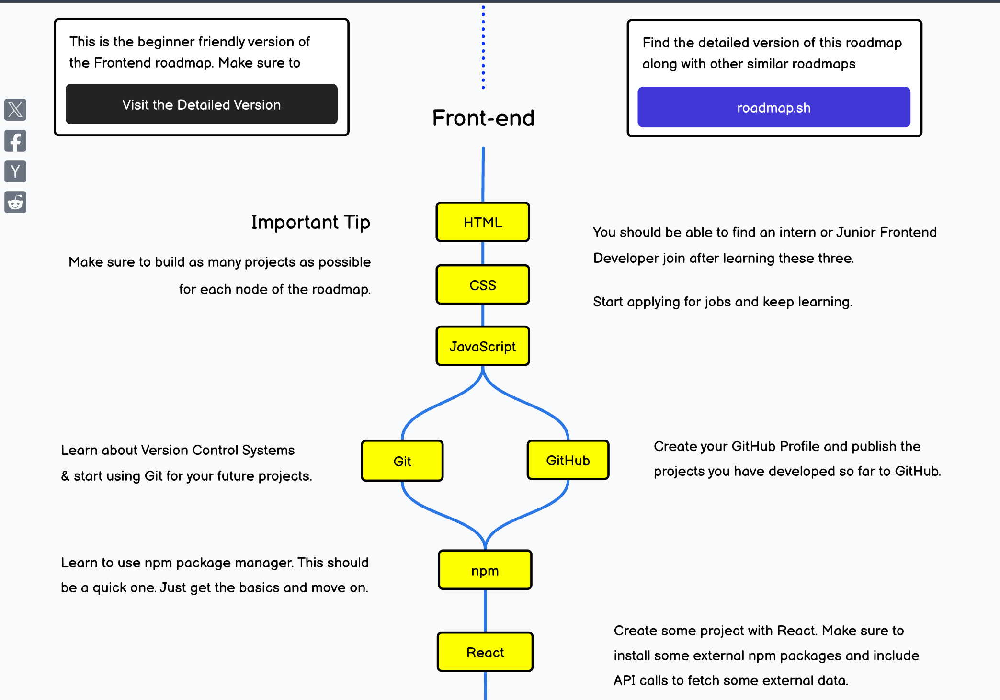

> 本文是前端基础知识，适合无基础小白阅读，快速上手&让代码跑起来展示在网页上
> 前端可以简单理解为将数据展示在网页上，web,h5,小程序,app 等等

## 导学

## 基础配置

- IDE(集成开发环境即开发软件) [VSCode](https://code.visualstudio.com/)
- 浏览器（chorme 优先，edge 也行）
- vscode 插件： live server 等等

:::tip[学习建议]
篇幅有限，这些对应知识点，自行搜索按照网上高赞教程学习即可
虽然是小白教程，但是还是需要自己主动，而不是一步一点喂到嘴里
如遇问题，问问 gpt，群里提问也可！！！
:::

## 学习资料

- [MDN](https://developer.mozilla.org/zh-CN/docs/Web)
  MDN 是最官方权威文档，有中文版，而且有详细的解释，适合小白学习
- [菜鸟教程](https://www.runoob.com/)
  菜鸟教程是入门教程，适合小白学习
  = b 站 up 主 黑马 pink

:::danger[注意]
学习的时候千万不要只无脑输入(做笔记不会有提示，要自己去敲代码)：有选择地看教程，带脑子去思考，使用项目驱动学习的方法，只吸收项目需要的，**跳过已经过时的、对现阶段太难的或现阶段用不上的**。

比如面对 JavaScript 中数组的方法这种很密集的知识点，不是说听一遍讲解跟视频敲一遍就会了的，之后该忘还是会忘，只有在实战中自发的使用这些方法，才会真正记住、理解他们。

先速通最热门的技术栈，不要搞些太冷门的东西
:::

### 目标

配置简单的开发环境，掌握初步的网站开发，能够完成结构略复杂的布局，进行简单的 DOM 操作

关键知识点：`基础标签（文本、表格、多媒体） HTML5 语义化标签 CSS 选择器与权重 常见样式 盒子模型 定位布局 弹性布局(Flex) 变形与动画 媒体查询 响应式布局 em/rem/vw JS 基础语法 基本类型 数组与对象类型及常用方法 函数进阶 面向对象 DOM 操作 ES6`

推荐实战案例：响应式布局还原某官网、JS 实现轮播图

:::note
如果有其他语言教育，三件套可能一个月就能学会了，无基础 3 个月也能基本差不多了。

有些知识点，可以先跳过，等以后用到的时候再回来查。**掌握基础和快速学习新知识的技巧**才是关键。
:::

ps: 一个前端小白路线图

### [10 分钟了解前端](https://www.bilibili.com/video/BV1hY411j7UM?buvid=XX1F2331974F7A021FC5FF529C12C668DCF22&from_spmid=default-value&is_story_h5=false&mid=mXUTniYrvpJH8ZBYhNGjAw%3D%3D&plat_id=116&share_from=ugc&share_medium=android&share_plat=android&share_session_id=8a3f8eea-70f3-46b5-836a-24b5e02f5fe1&share_source=WEIXIN&share_tag=s_i&spmid=united.player-video-detail.0.0&timestamp=1737045481&unique_k=0RlLcXr&up_id=34786453&wxfid=o7omF0eLIys9lFYWF_S6WWiHJY4U&share_times=1&vd_source=bb5ed4d50b55fb6a0df664e64b8b9ff4)

  <iframe
    style="position: absolute; top: 0; left: 0; width: 100%; height: 100%;"
    src="//player.bilibili.com/player.html?isOutside=true&aid=255704765&bvid=BV1hY411j7UM&cid=763377488&p=1&high_quality=1"
    scrolling="no"
    border="0"
    frameborder="no"
    framespacing="0"
    allowfullscreen="true"
  ></iframe>

## 1. HTML

HTML 是超文本标记语言，用于创建网页。

## 2. CSS

CSS 是层叠样式表，用于描述网页的样式。

多学习多查多敲代码，不能死记硬背

## 3. JavaScript

JavaScript 是用于创建动态和交互式网页的编程语言。

`DOM` `BOM` `AJAX` `Promise` `ES6` ......

三件套学完建议找个视频做个商场项目，再做个移动端商城

## 4. git

git 是用于管理代码版本控制的工具。

## 5.npm

npm 是用于管理 JavaScript 包的工具。
