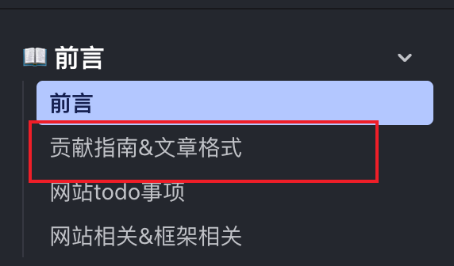

import { FileTree } from '@astrojs/starlight/components';

## 项目文档结构

- 文件路由：docs 目录下的文件名对应网站路由 url

<br />
<FileTree>

- src
  - content
    - docs
      - 前言
        - contribution-guide.mdx

</FileTree>

<br />

`md` `mdx` 文件里必须有要有下列格式，title 是必填项，对应了侧边栏文章的显示名称,description 是可选的，为了 seo 优化

<br />



```md
---
title: 贡献指南
description: 贡献指南
---
```

<br />

<a href="/前言/website">框架提供的一些组件</a>

待补充数学公式
