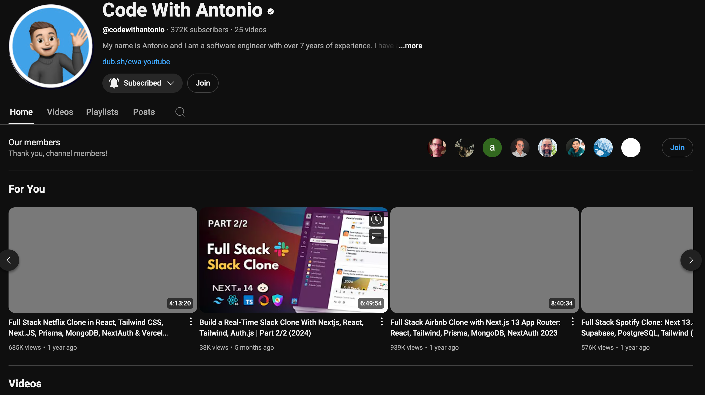

> 文章具有时效性，以笔者个人经验为主，仅供参考

## 前言

标题比较暴论，理论上3个月确实是可行的。

1. 前端门槛低，比后端容易入门
2. 前端岗位没有后端 Java 那么卷
3. 前端技术栈多，但学会关键基础部分即可找实习
4. 前端面试八股够熟悉，考察手写算法没后端难

:::tip
代价就是前端职业发展比后端差。有人带和没人带，前端学习效率差距非常大。有了 AI 的辅助，前端效率提升非常多。
:::

一点其他信息，前端:后端的比例大概为 1:3。前端就是将后端数据表现为页面展示出来。

## 补天计划

- 前端三件套一个月
- 框架&项目一个月
- 八股一个月

### 三件套

- HTML
- CSS
- JavaScript

参考另外一篇[文章](/前端开发/base)

### 框架&项目

框架国内无非 `Vue` 或者 `React`，任选其一就可以了。

#### React

React 学习资源还是比较多的，个人推荐**官方文档**。优先啃文档，跟着官方 demo 去一步一步实现。遇到不会的问题再去看视频。速成直接了解之后，直接上项目边做边问ai边学。

Youtube上8小时手把手的前端视频挺多的，跟者做完，知道基础重要技术栈即可

:::tip

1. 入门视频质量参差不齐，为了照顾所有人，会讲很多废话。
2. 文档是第一手材料，视频会忽略很多细节。
   :::

#### 项目

项目推荐 YouTube 上的教程视频，例如安东尼奥的教程视频，一步一步直接喂到嘴里。

8 小时，一步一步跟着敲代码。涉及到的组件库，CSS 方案，路由，状态管理，API 请求，项目部署都是重点。

:::tip
做完安东尼奥的项目。如果想要提升，可以考虑规划扩展，研究用到的技术的原理。
:::

### 简历&八股

这一部分也非常重要。

#### 信息差

可以当牛客首页提前了解一些应聘信息或者找**靠谱**的师兄咨询。学习路线参考运营组的另一篇文章。

:::tip
为什么要早实习：有实习没实习找工作的时候差距太多，公司会更倾向于有实习的学生，所以最好大四前要有实习经验。
:::

#### 用什么写简历

使用 Markdown 生成清晰的简历，简历最好比较简洁。

- [Muji 简历](https://www.mujicv.com/)
- 超级简历
- 牛客网

:::tip
简历注意要点：

- 专业名词不要打错
- 不要写岗位无关的东西
- 找一个好的模版（简洁&清晰）
- 技术岗位至少要两个项目
- 写出亮点
- 延长避短
  :::

#### 怎么投简历

1. Boss 直聘
   - Boss 上沟通回，HR 不回复你是正常情况，因为企业方回复是要钱的，已读不回是常态。
   - 写好打招呼语，比如你好，我是 xx，对 xx 岗位感兴趣，我有 xx 技能赶紧跟公司比较匹配，希望能够沟通一下。
2. 企业校招网站
   - 企业流程比较慢，而且都要独立填写信息。

#### 面试前的准备

**基础八股一定要背熟！！！**（尤其你没有实习或者实习内容比较浅薄，ps： 八股指常问的一些常规问题，有专门的网站可以去看）

去[牛客](https://www.nowcoder.com/)看看面试公司的面试记录，包含了问答。

:::tip
平时也可以多去看看，看看大佬的路线或者各种面筋。
:::

#### 面试的流程

##### 自我介绍

一般面试开始，面试官都会让你自我介绍。

介绍内容：

- 院校专业姓名
- 竞赛奖项或特长
- 项目

:::tip
要对自己的简历如数家珍，从这上面介绍。哪里是你的优点或者擅长的地方就多介绍一下。可以适度给挖坑。控制在 3-5 分钟左右，事先准备好。
:::

##### 八股问答

提前准备好。

##### 项目问答

提前准备好一下问题的答案，至少是简历那些可能会问的地方，使用方法和一定原理。

##### 反问

就算你答的不好，反问环节也要提问！！！

提问一下自己哪里不足或者问问怎么更好地学习。菜也没关系，别尴尬。

:::tip
正常询问内容：

- 公司的技术栈主要是什么？
- 公司文化，薪酬，上班时间，房补等
- 公司的主要业务
- 新人的培养，工作内容
  :::

#### 面试后的复盘

- 写面筋
- 听录音（面试前手机录音）

#### 其他问题

#### 长期实习和学校问题

不管怎样，你肯定都回答可以接受，学校方面没有问题（即使有问题）。

#### 面试紧张怎么办？

第一次面试紧张是**正常**的，多进行一些模拟面试(让`gpt4`喂你)或者看相关视频，可以**海投**简历，把小厂的面试放前面。

面的多或者模拟多其实就是不紧张了。

#### 太焦虑怎么办

现在我不知道，因为我现在很焦虑，尤其是看牛客更容易急，要找到缓解焦虑的方法。

#### 投哪里

优先 Boss 直聘，投小厂练习先，不要太急去大厂，可能会留坏的面评。

#### 实习不多或者没有怎么办

这是一个难受的问题，对于双非我觉得秋招至少要有一份实习，有一次至少公司不用从零开始培养你之类的。重要的是让公司看出你在多份实习中的潜力。

#### 前端模拟面试视频

[山月](https://space.bilibili.com/28696526)
