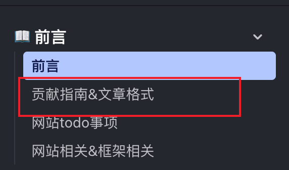

import { FileTree } from "@astrojs/starlight/components";
import { Steps } from "@astrojs/starlight/components";

## 项目文档结构

- 文件路由：docs 目录下的文件名对应网站路由 url

<br />
<FileTree>

- src
  - content
    - docs
      - 指南
        - contribution-guide.mdx

</FileTree>

<br />

## 文章格式

`md` `mdx` 文件里必须有要有下列格式，title 是必填项，对应了侧边栏文章的显示名称,description 是可选的，为了 seo 优化

<br />



```md
---
title: 贡献指南
description: 贡献指南
---
```

<br />

### 文章语法

- <a href="/其他/website">框架组件</a> (导入后直接使用)
- <a href="/其他/test">markdown语法</a>
- 数学公式待补充

## 项目启动

<Steps>

1. 安装必要的开发环境

   - 安装 Node.js
   - 安装 pnpm

2. 安装项目依赖并启动开发服务器

   ```bash
   pnpm install
   pnpm dev
   ```

   执行完上述命令后即可在本地启动项目

3. 构建项目
   ```bash
   pnpm build
   ```
   此命令会检查项目语法错误并生成生产环境代码

</Steps>
