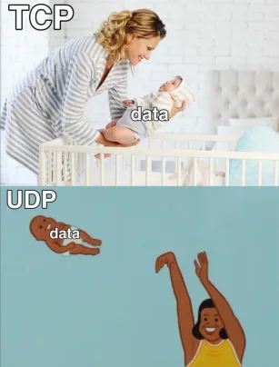

## 0.背景

:::tip[基础知识]
对于很多大学生来说，计算机知识方面是个盲区，甚至上了大学才第一次用电脑，会接触到很多陌生的名词让人无从下手，我也不例外，本文章作为一个引子，粗略介绍计算机知识中各种专有名词。
对于本篇提到的所有知识，仅仅是作为一个扫盲来用，至少在根别人交流时你不会一头雾水。
:::

:::caution[注意]
本篇文章只有引导作用，本着知识科普的目的，如果要想详细理解这些知识可以去搜索相关文章阅读。
:::

## 1.计算机网络

### 1.1 理论知识

:::note
由 guide 哥写的[关于计网的总结](https://cloud.tencent.com/developer/article/1736519)，主要来源于《计算机网络第七版 谢希仁著》是计算机网络的基础，读起来可能有点枯燥，但是这是个必修课程，可以先提前看一遍了解一下。
:::

[互联网数据传输原理 OSI 七层网络参考模型](https://www.bilibili.com/video/BV1EU4y1v7ju/?share_source=copy_web&vd_source=e7e08f6b0c163ad5e92026d6e7c98a9b)

### 1.2 IP/IPv4/IPv6

:::note
对于计网，一切的起源就是 IP 了，大家应该都听过 IP 这个名词，他是计算机间通信的基础。
:::

[为什么大家的 IP 都是 192.168 开头的？](https://www.bilibili.com/video/BV1HL41117tZ/?share_source=copy_web&vd_source=e7e08f6b0c163ad5e92026d6e7c98a9b)

[硬核科普 IP 地址是什么东西？IPV6 和 IPV4 有什么区别？公网 IP 和私有 IP 又是什么？](https://www.bilibili.com/video/BV1DD4y127r4/?share_source=copy_web&vd_source=e7e08f6b0c163ad5e92026d6e7c98a9b)

**提高阅读**

[计算机网络 TCP/IP 协议-从双绞线到 TCP](https://www.bilibili.com/video/BV1ut421374J/?share_source=copy_web&vd_source=e7e08f6b0c163ad5e92026d6e7c98a9b)

[IPv6 和 IPv4 的主要区别？子网掩码，二进制转化，地址分类，头部，安全有什么不同？](https://www.bilibili.com/video/BV1aF411v7hU/?share_source=copy_web&vd_source=e7e08f6b0c163ad5e92026d6e7c98a9b)

[IPv4 地址和子网掩码](https://www.bilibili.com/video/BV1xu411f7UW/?share_source=copy_web&vd_source=e7e08f6b0c163ad5e92026d6e7c98a9b)

### 1.3 VPN/代理

:::note
为什么我访问 github 访问不了？为什么我连的 steam 有时会网络错误？你问别人别人会跟你说要用`魔法`，没挂`梯子` 这里就是说的 `VPN` ，至于如何获得外网 VPN，这里不做介绍。
:::

[VPN 概念，技术原理和误区](https://www.bilibili.com/video/BV1KY411t75D/?share_source=copy_web&vd_source=e7e08f6b0c163ad5e92026d6e7c98a9b)

[什么是正向代理？什么是反向代理？一分钟最详解答，新手必备，入门教程](https://www.bilibili.com/video/BV1SM411X7ye/?share_source=copy_web&vd_source=e7e08f6b0c163ad5e92026d6e7c98a9b)

### 1.4 域名/DNS 解析

:::note
有没有想过为什么我们在浏览器中输入 `www.baidu.com` 就可以跳转到百度官网之后进行搜索，`www.baidu.com` 就是百度的域名，至于为什么我们输入`www.baidu` 就能跳转到百度官网而不是抖音官网，就是依托的 DNS 域名解析。
:::

[DNS 域名解析过程](https://www.bilibili.com/video/BV1uL4y1B7aE/?share_source=copy_web&vd_source=e7e08f6b0c163ad5e92026d6e7c98a9b)

### 1.5 HTTP/HTTPS 协议/CA 证书

:::note
对于每个网址，我们访问他都需要使用`HTTP`/`HTTPS`，协议，`HTTP`和`HTTPS`有什么区别？为什么`HTTPS`会比`HTTP`安全？
:::

[HTTP 是什么？](https://www.bilibili.com/video/BV1zb4y127JU/?share_source=copy_web&vd_source=e7e08f6b0c163ad5e92026d6e7c98a9b)

[在浏览器输入 URL 回车之后发生了什么？](https://www.bilibili.com/video/BV1s44y117vK/?share_source=copy_web&vd_source=e7e08f6b0c163ad5e92026d6e7c98a9b)

[HTTPS 是什么？加密原理和证书。SSL/TLS 握手过程](https://www.bilibili.com/video/BV1KY411x7Jp/?share_source=copy_web&vd_source=e7e08f6b0c163ad5e92026d6e7c98a9b)

[4 分钟看懂 HTTP 状态码](https://www.bilibili.com/video/BV15B4y1f76w/?share_source=copy_web&vd_source=e7e08f6b0c163ad5e92026d6e7c98a9b)

[超好玩,教你如何把 http 状态码变成猫](https://www.bilibili.com/video/BV1sT4y1f7Y3/?share_source=copy_web&vd_source=e7e08f6b0c163ad5e92026d6e7c98a9b)

**提高阅读**

[数字签名和 CA 数字证书的核心原理和作用](https://www.bilibili.com/video/BV1mj421d7VE/?share_source=copy_web&vd_source=e7e08f6b0c163ad5e92026d6e7c98a9b)

[数学不好也能听懂的算法 - RSA 加密和解密原理和过程](https://www.bilibili.com/video/BV1XP4y1A7Ui/?share_source=copy_web&vd_source=e7e08f6b0c163ad5e92026d6e7c98a9b)

[HTTP/1.1，HTTP/2 和 HTTP/3 的区别](https://www.bilibili.com/video/BV1vv4y1U77y/?share_source=copy_web&vd_source=e7e08f6b0c163ad5e92026d6e7c98a9b)

[从点击网页到显示需要多少步-DNS、HTTP、CA、TLS、HTTPS](https://www.bilibili.com/video/BV1Tx421m7Hv/?share_source=copy_web&vd_source=e7e08f6b0c163ad5e92026d6e7c98a9b)

[从密折制度到对称加密到非对称加密](https://www.bilibili.com/video/BV1aG411k7RF/?share_source=copy_web&vd_source=e7e08f6b0c163ad5e92026d6e7c98a9b)

[公钥加密技术 ECC 椭圆曲线加密算法原理](https://www.bilibili.com/video/BV1BY411M74G/?share_source=copy_web&vd_source=e7e08f6b0c163ad5e92026d6e7c98a9b)

### 1.6 DHCP

:::note
如果你会打开 cmd，可以在你的 cmd 框中输入`ifconfig`来查看你本机 ip 地址，那么有没有想过这个以`192`开头的 IP 地址是谁给你的？
:::

[DHCP 运作原理和握手过程](https://www.bilibili.com/video/BV1Gd4y1n7Xz/?share_source=copy_web&vd_source=e7e08f6b0c163ad5e92026d6e7c98a9b)

### 1.7 NAT 模式/Bridge 模式/Host 模式 虚拟网络

[虚拟机网络模式 NAT | NAT 网络 | 桥接 Bridged | 内部网络 Internal | 仅主机(Host-Only)](https://www.bilibili.com/video/BV11M4y1J7zP/?share_source=copy_web&vd_source=e7e08f6b0c163ad5e92026d6e7c98a9b)

### 1.8 ARP 协议

:::note
如何通过一个 ip 找到另外一台电脑？
:::

[一条视频讲清楚什么是 ARP 协议-ARP 攻击又是什么](https://www.bilibili.com/video/BV16t4y1d7ev/?share_source=copy_web&vd_source=e7e08f6b0c163ad5e92026d6e7c98a9b)

[简单说网络 1-计算机是如何通信的？IP 地址与 mac 地址是什么？dhcp 与 arp 又是什么？](https://www.bilibili.com/video/BV1CQ4y1d728/?share_source=copy_web&vd_source=e7e08f6b0c163ad5e92026d6e7c98a9b)

### 1.9 CDN/OSS

:::note
使用 CDN 可以加快网站访问速度，OSS 是云对象存储，也可以加快网站的渲染速度
:::

[什么是 CDN？CDN 能为我们做什么？我们为什么要了解他？](https://www.bilibili.com/video/BV1jS4y197zi/?share_source=copy_web&vd_source=e7e08f6b0c163ad5e92026d6e7c98a9b)

[cdn 是什么？用了一定更快吗？](https://www.bilibili.com/video/BV1nY411m7Ap/?share_source=copy_web&vd_source=e7e08f6b0c163ad5e92026d6e7c98a9b)

[CDN 是什么?用了一定更快吗？（上）](https://www.bilibili.com/video/BV1Ez421d7TC/?share_source=copy_web&vd_source=e7e08f6b0c163ad5e92026d6e7c98a9b)

[1 亿张照片怎么存？6 分钟速通 OSS，变身云专家](https://www.bilibili.com/video/BV1vay2YCEeh/?share_source=copy_web&vd_source=e7e08f6b0c163ad5e92026d6e7c98a9b)

### 1.10 TCP/UDP/QUIC

:::note
直接拿一张图来说话
:::

[理解 TCP 和 UDP 协议的核心原理和区别](https://www.bilibili.com/video/BV1854teHE2d/?share_source=copy_web&vd_source=e7e08f6b0c163ad5e92026d6e7c98a9b)

[一条视频讲清楚 TCP 协议与 UDP 协议-什么是三次握手与四次挥手](https://www.bilibili.com/video/BV1kV411j7hA/?share_source=copy_web&vd_source=e7e08f6b0c163ad5e92026d6e7c98a9b)
[原神用的是 TCP 还是 UDP? KCP 是什么？](https://www.bilibili.com/video/BV1wC4y1D7H3/?share_source=copy_web&vd_source=e7e08f6b0c163ad5e92026d6e7c98a9b)

[QUIC 核心原理和握手过程](https://www.bilibili.com/video/BV1Mg411s7mP/?share_source=copy_web&vd_source=e7e08f6b0c163ad5e92026d6e7c98a9b)

[TCP 三次握手和四次挥手](https://www.bilibili.com/video/BV18h41187Ep/?share_source=copy_web&vd_source=e7e08f6b0c163ad5e92026d6e7c98a9b)

[HTTP/3 是什么？为什么需要一个新版本？QUIC 为什么基于 UDP？](https://www.bilibili.com/video/BV1Ru4y1f7Ph/?share_source=copy_web&vd_source=e7e08f6b0c163ad5e92026d6e7c98a9b)

**提高阅读**

:::tip[提示]
tcp 和 udp 的八股文太多了 感兴趣可以看小林 coding 学习
:::
[一条视频讲清楚 TCP 协议与 UDP 协议-什么是三次握手与四次挥手](https://www.bilibili.com/video/BV1kV411j7hA/?share_source=copy_web&vd_source=e7e08f6b0c163ad5e92026d6e7c98a9b)

[用了 TCP 就一定不会丢包吗？](https://www.bilibili.com/video/BV1YV4y1P7jf/?share_source=copy_web&vd_source=e7e08f6b0c163ad5e92026d6e7c98a9b)

[用 UDP 就一定比 TCP 快吗](https://www.bilibili.com/video/BV1ne411A7hP/?share_source=copy_web&vd_source=e7e08f6b0c163ad5e92026d6e7c98a9b)

### 1.11 WebSocket/SSE 通信

:::note
为什么有了 http 我们还需要其他通信协议？
:::

[websocket 是什么？和 HTTP 是什么区别？长轮询是什么？服务器推是什么？](https://www.bilibili.com/video/BV1684y1k7VP/?share_source=copy_web&vd_source=e7e08f6b0c163ad5e92026d6e7c98a9b)

**提高阅读**

[WebSockets 原理，握手和代码实现！用 Socket.io 制作实时聊天室](https://www.bilibili.com/video/BV1n3411u7uf/?share_source=copy_web&vd_source=e7e08f6b0c163ad5e92026d6e7c98a9b)

### 1.12 RPC

:::note
后端必备技能，会用了之后会轻松的实现分布式系统
:::

[RPC 是什么？HTTP 是什么？RPC 和 HTTP 有什么区别？](https://www.bilibili.com/video/BV1Qv4y127B4/?share_source=copy_web&vd_source=e7e08f6b0c163ad5e92026d6e7c98a9b)

### 1.13 Cookie/Session/Token

:::note
服务器是如何区分一个个用户的？
:::

[Cookie、Session、Token 究竟区别在哪？如何进行身份认证，保持用户登录状态？](https://www.bilibili.com/video/BV1ob4y1Y7Ep/?share_source=copy_web&vd_source=e7e08f6b0c163ad5e92026d6e7c98a9b)

[Cookie、Session、Token、JWT 一次性讲完](https://www.bilibili.com/video/BV18u4m1K7D4/?share_source=copy_web&vd_source=e7e08f6b0c163ad5e92026d6e7c98a9b)

**提高阅读**

[JWT 如何应用到服务器？Node.js 认证代码演示](https://www.bilibili.com/video/BV1KY4y1q7PU/?share_source=copy_web&vd_source=e7e08f6b0c163ad5e92026d6e7c98a9b)

## 2. 网络安全

:::caution
本人非网安专业，介绍相关知识只是用作扫盲用途。
:::

### 2.1 DDos 网络攻击

:::note
估计很多人听 DDos 脑海中想到的第一个词就是黑客。
:::

[科普：黑客是如何进行 DDoS 攻击的？](https://www.bilibili.com/video/BV1BBSMYXEB9/?share_source=copy_web&vd_source=e7e08f6b0c163ad5e92026d6e7c98a9b)

[如何一分钱不花防护 DDOS 攻击](https://www.bilibili.com/video/BV11a4y1C7ew/?share_source=copy_web&vd_source=e7e08f6b0c163ad5e92026d6e7c98a9b)

### 2.2 中间人攻击

:::note
大家一般连接有问题的 wifi，信任没有备案的域名会有这种情况。
:::

[什么是中间人攻击](https://www.bilibili.com/video/BV1XP4y1G71F/?share_source=copy_web&vd_source=e7e08f6b0c163ad5e92026d6e7c98a9b)

### 2.3 Sql 注入

:::note
首先要理解什么是数据库，Sql 是一门与数据库交互的语言
:::

[SQL 注入攻击原理，方法和类型](https://www.bilibili.com/video/BV1ZR4y1Y745/?share_source=copy_web&vd_source=e7e08f6b0c163ad5e92026d6e7c98a9b)

### 2.4 CSRF 跨站攻击

[跨站请求伪造 CSRF 攻击的原理以及防范措施](https://www.bilibili.com/video/BV1UH4y1)

[CSRF（跨站请求伪造）攻击与防御](https://www.bilibili.com/video/BV1xF4m1M7kQ/?share_source=copy_web&vd_source=e7e08f6b0c163ad5e92026d6e7c98a9b)

### 2.5 XSS 攻击

[XSS 网络攻击 - 原理，类型和实践](https://www.bilibili.com/video/BV1rg411v7B8/?share_source=copy_web&vd_source=e7e08f6b0c163ad5e92026d6e7c98a9b)

### 2.6 IDOR 越权

[IDOR 漏洞的原理，实战和预防](https://www.bilibili.com/video/BV1iz4y1B7K4/?share_source=copy_web&vd_source=e7e08f6b0c163ad5e92026d6e7c98a9b)

## 3. 计算机系统

### 3.1 理论知识

:::note
本文这里不作推荐，因为本人计算机系统也不是特别好，感兴趣的可以搜一搜相关书籍查看
:::

### 3.2 VPS/服务器

:::note
做软件开发离不开的设备
:::

[白话科普服务器是什么 ｜能做什么 | 和电脑有什么区别 | 什么是云服务器 | 网站上线系列分享](https://www.bilibili.com/video/BV1bk4y1m79S/?share_source=copy_web&vd_source=e7e08f6b0c163ad5e92026d6e7c98a9b)

[有用的小知识服务器到底是什么？选 VPS 还是 VDS？NAT 和虚拟主机是个啥？裸金属是个啥？ECS 和 CVM 又是啥？](https://www.bilibili.com/video/BV1vY411u7Zw/?share_source=copy_web&vd_source=e7e08f6b0c163ad5e92026d6e7c98a9b)

### 3.3 虚拟化/虚拟机

:::note
现在比较火的就是 docker 和 k8s 的概念了
:::

[IT 科普就你叫虚拟化啊？](https://www.bilibili.com/video/BV1XB4y1Z769/?share_source=copy_web&vd_source=e7e08f6b0c163ad5e92026d6e7c98a9b)

[物理机、虚拟机和容器有什么区别？](https://www.bilibili.com/video/BV1nd4y1K7jE/?share_source=copy_web&vd_source=e7e08f6b0c163ad5e92026d6e7c98a9b)

### 3.4 docker k8s

:::note

后端/运维工程师必备技能。我现在基本上所有中间件都是使用 docker 部署和来管理。

:::

[docker 容器和传统虚拟机有什么区别？](https://www.bilibili.com/video/BV1jC41187ae/?share_source=copy_web&vd_source=e7e08f6b0c163ad5e92026d6e7c98a9b)

[docker 是什么？和 kubernetes(k8s)是什么关系？](https://www.bilibili.com/video/BV1aA4m1w7Ew/?share_source=copy_web&vd_source=e7e08f6b0c163ad5e92026d6e7c98a9b)

[k8s 是什么？Kubernetes 是什么？架构是怎么样的？6 分钟快速入门](https://www.bilibili.com/video/BV1Du4m137pK/?share_source=copy_web&vd_source=e7e08f6b0c163ad5e92026d6e7c98a9b)

### 3.5 操作系统

[操作系统究竟是怎么发展而来的，你真的了解吗？操作系统发展史](https://www.bilibili.com/video/BV1Zc411D7sG/?share_source=copy_web&vd_source=e7e08f6b0c163ad5e92026d6e7c98a9b)

### 3.6 计算机架构/ARM/x86

[云服务器的"性能和价格"之争，从 X86 卷到了 ARM](https://www.bilibili.com/video/BV14PBqYJEu6/?share_source=copy_web&vd_source=e7e08f6b0c163ad5e92026d6e7c98a9b)

## 4. 计算机组成原理

### 4.1 计算机工作原理

:::note
当个科普视频看看吧
:::

[一口气 30 分钟彻底搞懂！ 计算机内存工作原理 💻🛠](https://www.bilibili.com/video/BV16r421K7qs/?share_source=copy_web&vd_source=e7e08f6b0c163ad5e92026d6e7c98a9b)

### 4.2 计算机组成原理

**提高阅读**

[计算机组成原理-透视版(上)](https://www.bilibili.com/video/BV1AnB8YxEw7/?share_source=copy_web&vd_source=e7e08f6b0c163ad5e92026d6e7c98a9b)

[计算机组成原理-透视版(中)](https://www.bilibili.com/video/BV1edBKYVEwo/?share_source=copy_web&vd_source=e7e08f6b0c163ad5e92026d6e7c98a9b)

[计算机组成原理-透视版(下)](https://www.bilibili.com/video/BV1iD68YQER6/?share_source=copy_web&vd_source=e7e08f6b0c163ad5e92026d6e7c98a9b)

### 4.3 Linux

[软件科普认识 Linux 系统](https://www.bilibili.com/video/BV1JL4y1F7p9/?share_source=copy_web&vd_source=e7e08f6b0c163ad5e92026d6e7c98a9b)

## 5. 结束语

:::tip[杂谈]
写这个扫盲也是心血来潮，在我第一次实习的时候，跟我一起进那家公司的有另外一个实习生，感觉他就懂得好多好多，自己当时什么都不懂，就会敲敲代码，感觉差距挺大的，就在空闲时间搜集这些基础知识来看。
所有视频都是找的比较容易理解的视频，以通俗的动画来进行讲解，希望对大家有帮助。
:::

:::note
若有遗漏欢迎补充
:::
