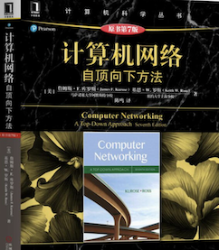

> 计算机网络在面试中占比很大，特别是大厂，它有点类似文科，需要背很多知识。这里网推荐先从视频入门，然后看书深入学习，找工作的时候看小林的八股。

- 课程

  推荐中科大的[计算机网络](https://www.bilibili.com/video/BV1JV411t7ow/?spm_id_from=333.337.search-card.all.click)，老师是按照自顶向下顺序讲解，内容不枯燥。

- 书籍

  推荐《计算机网络：自顶向下方法》强烈建议读一读，会对计算机网络有更深的认识，而不是局限于八股。

- 面试和八股

  这里推荐小林 coding 的[计算机网络面试题](https://xiaolincoding.com/network/) 里面基本覆盖了计网的八股。
