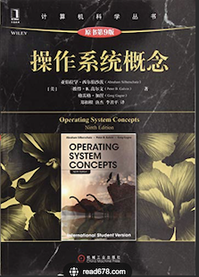

> 进大厂，操作系统必考，学习技巧就是多看书，多背知识点。

- 课程

  推荐王道[操作系统](https://www.bilibili.com/video/BV1YE411D7nH/?spm_id_from=333.337.search-card.all.click&vd_source=04683f9ad448ee89bbe44be5d8abd459)，常见的操作系统知识都讲了。

- 书籍

  推荐《操作系统概念》这本书。

。

- 面试和八股

  这里推荐小林 coding 的[操作系统面试题](https://xiaolincoding.com/os/)。
